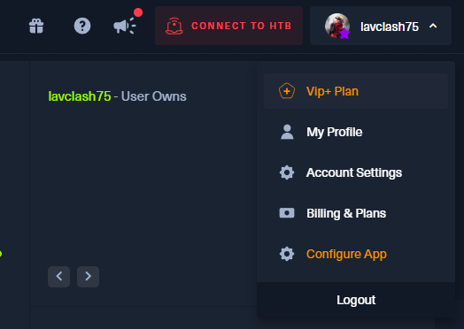
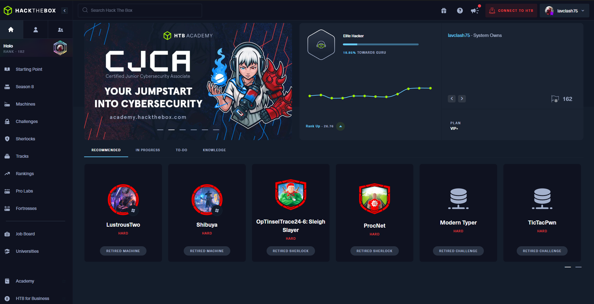
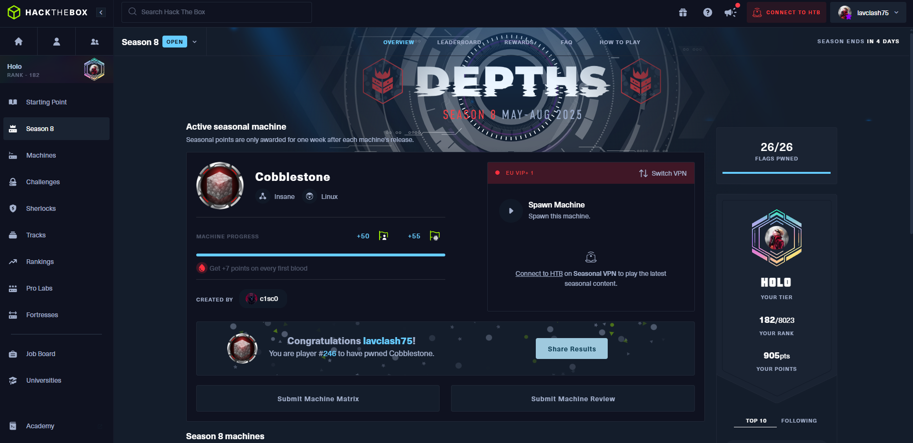
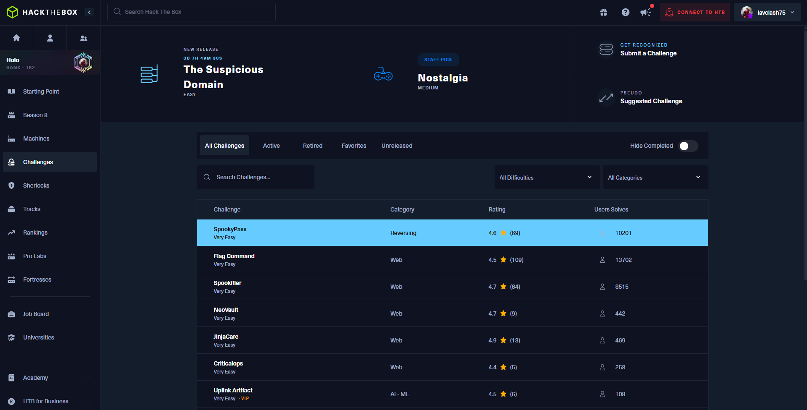
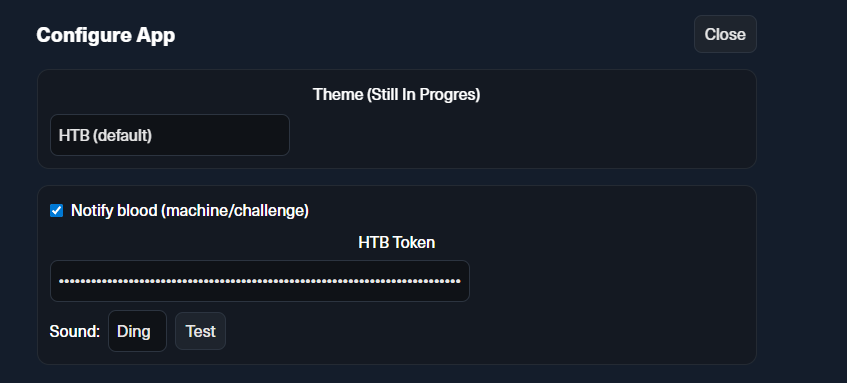

# HTB Desktop

A lightweight Electron wrapper for Hack The Box with a native-like desktop experience, in-app settings, auto-updates, and a few quality-of-life tweaks.

---

## Features

- **In-app “Configure App” view** :  settings render *inside* the HTB layout.
- **Custom theme(Still In Progres)**: switch HTB’s green highlights to another accent (e.g., blue).
- **Blood notifications (Machines & Challenges)**
  - Uses your HTB token (stored locally).
- **Persistent preferences** in the app’s user data folder.
- **Auto-updates via GitHub Releases (Still In Progres)** (electron-updater + electron-builder).

## Usage Notes

### In-App Settings
Open the user menu on HTB (top-right) and click Configure App.
A settings view overlays inside the HTB layout.

### Themes (Still In Progres)
Default: HTB green.

Alternatives: Blue, Red

### Blood Notifications
Enable the switch, paste your HTB token, and choose a sound.

Sounds trigger only when counts increase (new user/root bloods or a new challenge blood).

